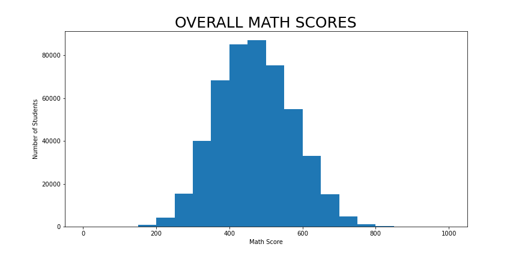
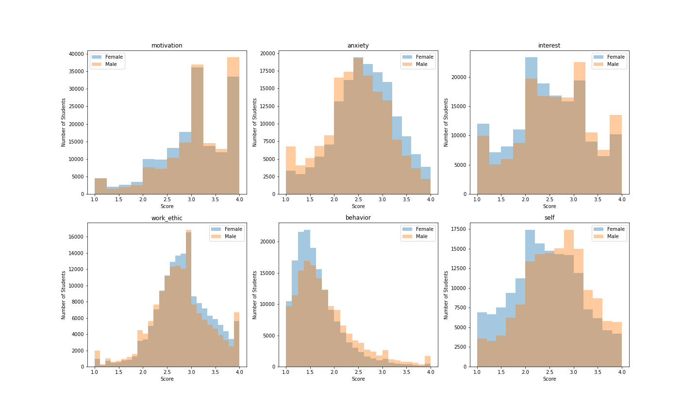

# OVERVIEW

This is Udacity's fifth project under Data Analyst Nanodegree Program. This project focused on performing an exploratory data analysis using Python (Matplotlib and Seaborn) and then creating a presentation with explanatory plots that communicate our findings .

# ABOUT THE DATASET

PISA is a unique global survey that examines how well prepared 15 year old students are for life after they have completed school. Approximately half a million students and 65 economies participated in this assessment that deals with reading, math, and science literacy.

The full 2012 PISA dataset can be found [here.](pisa2012.csv/pisa2012.csv)

The PISA data dictionary, which gives a brief explaination of each feature, can be found [here.](pisadict2012.csv)

The original PISA 2012 dataset contained information from 485,490 students and 646 features. After our data cleaning process, we condensed the number of features to 10: country, gender, overall math score, motivation score, anxiety score, interest score, work ethic score, behavior score, and parent's attitude towards math score. All features under attitude (with the exception of anxiety) have a scale of 4 points, marking highest positive attitude, to 1 point, marking a negative attitude. Anxiety works conversly, where 1 points shows a student to be less anxious (positive attitude) and 4 points being really anxious towards math (negative attitude).

My data cleaning process can be found [here.](pisa2012_data_cleanup.ipynb)

***

In this investigation, I wanted to take a closer a look at what attitudes of both the students and parents that contributed to overall PISA score's gender gap. The main focus was gender, different kinds of attitudes of students towards math (motivation, anxiety, interest, work ethic, behavior) as well as the the student's perception on how their parent's view math. 

# Summary of Findings

In this exploration, I found that the top performing students (based on their overall math scores) were majority males. Surprisingly, when I explored further and took the top 75th, 90th, 95th, and 99th percentile of students, I noticed that this proportion of male student continued to increase. When I ploted the results on a line plot, we can see clearly that as the top percentile of students increased, so does the gender gap. Initially, the female proportion was higher (due to the fact that there was a slightly more female students taking the survey as compared to the male students). But by the time we arrived to the top (approximately) 20th percentile, the amount of female students was equal to the amount of male students. Throughout the increase of top percentiles, we see that the proportion of male students strictly increases as well. The further we get along the top percentile of students, the gender gap's increase accelerates.

We can also see a pattern among the student and parent's attitude towards math for our top performing students. As the top pecentile of students increases, the male students' average scores for motivation, behavior, perception of parent's attitude towards math, interest, and self perception always remained higher than the female students' average scores under these categories. All of these categories were positive attitudes. Contrary, the female student's average score under anxiety always remained higher that the male students average score as the top percentile of students increased. The only positive attitude that continued to remain higher than the male counterpart was work ethic.

### DISTRIBUTION OF OVERALL MATH SCORE

The overall math scores are normally distributed with a mean around 469 points. The math scores range from the lowest being 19.8 points to the highest, which was 962.2 points. 

### DISTRIBUTION OF ATTITUDE SCORES BY GENDER

If we take a look at the distribution of high scores in the category of motivation, interest, behavior and self, the male students outweight the females students. But if we take a look at the high scores when it comes to anxiety and work ethic, the females students seem to score higher than the male students. 

### GENDER PROPORTATION BY TOP PERCENTILE STUDENTS

We can see clearly here that as the top percentile increases, so does the gender gap. Initially, the female proportion was higher (due to the fact that there was a slightly more female students taking the survey as compared to the male students). But by the time we arrived to the top (approximately) 20th percentile, the amount of female students was equal to the amount of male students. All throughout the increase of top percentiles, we see that the proportion of male students strictly increases as well. Notice that the further we get along the top percentile of students, the gender gap's increase accelerates.

### MOTIVATION SCORES BY TOP PERCENTILE STUDENTS BY GENDER

**The average motivation score for males is consistently higher that the average motivation score for females.**

### ANXIETY SCORES BY TOP PERCENTILE STUDENTS BY GENDER

**The average anxiety score for females is consistently higher than the average anxiety score for males. As the top percentile increases, the anxiety scores for both gender decreases.**

### INTEREST SCORES BY TOP PERCENTILE STUDENTS BY GENDER

**The average interest score for males is consistently higher that the average interest score for females.**

### WORK ETHIC SCORES BY TOP PERCENTILE STUDENTS BY GENDER

**The average work ethic score for females is consistently higher that the average work score for males.**

### PARENT SCORES BY TOP PERCENTILE STUDENTS BY GENDER

**The average parent score for males is consistently higher that the average motivation score for females. Notice how there is a sharp dip in parent score for males students at around the 85th percentile.**

### BEHAVIOR SCORES BY TOP PERCENTILE STUDENTS BY GENDER

**The average behavior score for males is consistently higher that the average behavior score for females.**

### MOTIVATION SCORES BY TOP PERCENTILE STUDENTS BY GENDER

**The average self score for males is consistently higher that the average self score for females. Note how there is a large gap between how females feel about themselves regarding their math skills as compared to how males feel about themselves in their math skills.**

